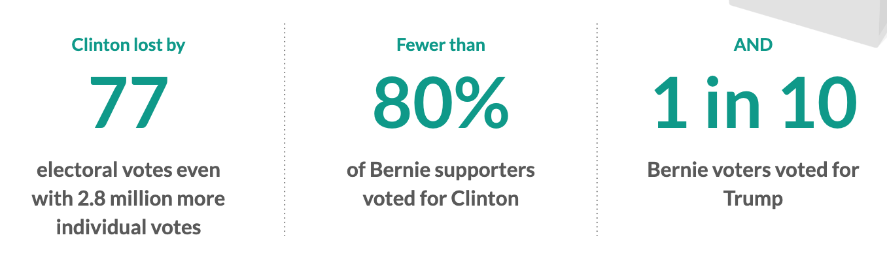
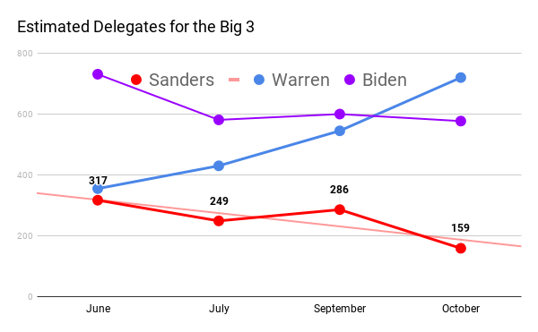
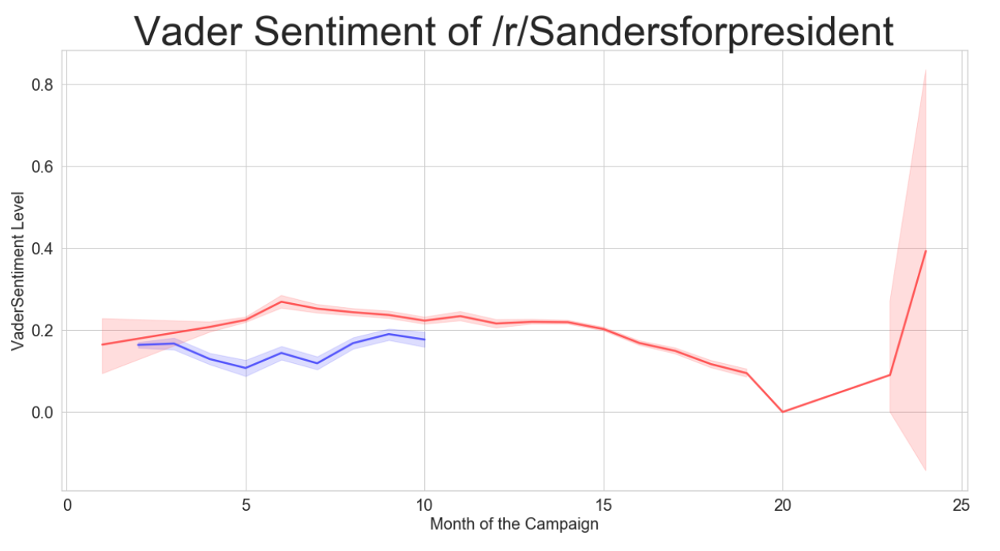
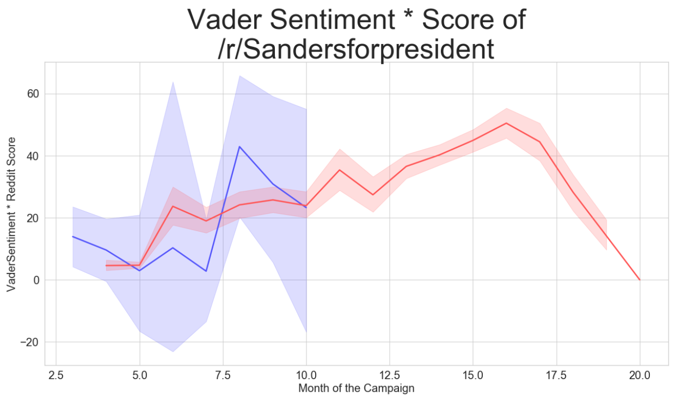

# /r/SandersforPresident 2016 / 2020 Classification Project

_Justin August_, General Assembly Data Science Immersive Fall 2019

1. [Problem Statement](#problem-statement)
2. [Data](#data)
3. [Modeling](#modeling)
4. [Key Takeaways](#key-takeaways)
5. [Recommendations](#recommendations)
6. [Media Links](#media-links)

## Problem statement

In 2016 after Bernie Sanders did not win the nomination for the Democratic party, Donald Trump was elected. Some stats from that election are.

Currently Bernie Sanders is losing estimated delegates - [approximately 50% already](https://twitter.com/kabir_here/status/1183418576218329088/photo/1). This points to him not being the nominee in 2020.

- Can we predict the likely behavior of Bernie Sanders’ supporters based on differences between Reddit posts to /r/Sandersforpresident between the two campaigns?
- What might explain those differences?
- What does this mean for Democrats in 2020?

## Data

Target Variable: `is_2016`

Volume: over 300,000 rows of data. Nearly all posts from the announcement of the 2016 campaign until election day. Nearly all posts from the announcement of the 2020 campaign until October 16.

### Dictionary

|Column Name|Type|Description|
|---|---|---|
|body|string|The text component of posts and comments. Created from the title + selftext of submissions|
|vaderSentiment|float|Composite score via the Vader Sentiment analyzer. -1 to 1 indicating positivity.|
|score|int|Reddit score of a post indicating total upvotes minus total downvotes|
|senti_score|float|Combination of vaderSentiment * score to amplify the relative sentiment as assessed by the community|
|created_utc|datetime|date of posting|

### Fetching

To collect this data, the [PushShift.io](http://PushShift.io) API was was used to gather posts & submissions from [Reddit](http://reddit.com). The subreddit selected was `/r/SandersforPresident`.

### Cleaning

Any `null()` values were due to mistakes in the data collection process. They were dropped and made up a very small percentage of the data.

### Feature Engineering

Few features were engineered:

- [Vader Sentiment](https://github.com/cjhutto/vaderSentiment)
- Senti_Score = VaderSentiment * [Score](https://www.reddit.com/wiki/faq#wiki_how_is_a_submission.27s_score_determined.3F)

## Modeling
Several GridSearches were done to create a classification model.

### Potential Transformers in the Gridsearch

- NLTK Lemmatizer
- PorterStemmer
- [Reddit Tokenizer](https://github.com/erikavaris/tokenizer)
- TD-IDF
- CountVectorizer

### Classifers
Several were evaluated. The most relevant and useful are highlighted here:

|Classifier|Transformers|Accuracy w/o Vader| Accuracy w Vader| Accuracy w senti_score|
|---|---|----|----|----|---|
|Logistic Regression with L2 Penalty |CountVectorizer, NLTK Stop Words|0.848|0.846|0.806|
|Logistic Regression with L2 Penalty|TF-IDF, NLTK Stop Words, Lemmatizing Tokenizer|0.851| | |
|RandomForest|TF-IDF, NLTK Stop Words, default tokenizer|0.788|0.788|0.791|
|KNearestNeighbors|PorterStemmer, Lemmatizing Tokenizer, TF-IDF, NLTK Stop Words|0.730| | |
|Bagging Decision Trees|PorterStemmer, Lemmatizing Tokenizer, TF-IDF, NLTK Stop Words|0.746|0.749|0.749|
|SVC|PorterStemmer, Lemmatizing Tokenizer, TF-IDF, NLTK Stop Words| | | |

## Key Takeaways

There is clearly a detectable difference between the posts made during the 2016 and current campaign. This brings up a new point: why is there a difference and what might it mean?

### Sentiment Analysis

Adding the Sentiment Analysis into the equation added more data that's key to not just classifying but also understanding the data. As you can see, the blue is Sanders' posters' sentiment in the current campaign and the red is Sanders' posters' sentiment in the 2016 campaign.

The sentiment is lower than the previous campaign. If we assume that high rates of frustration and anger will lead to folks staying home on election day - or voting against the Democrats this is not great news.

When combining the score of the post with the Vader sentiment our graph changes.

The positive and negative values of the sentiment score are amplified by multiplying it by the score of the post. Thus a high scored negative post will appear more negative, a highly scored positive post will appear more positive.
This implies two things:

1. The sentiment as magnified by the score is far more variable this year. This could mean that minds are not made up as to what their sentiment and overall feeling is.
2. Sentiment is no worse than last time around - in fact it is nearly perfectly aligned.

## Recommendations
1. **LISTEN** - Sanders' supporters were widely dismissed last time post-convention. It was assumed they would step in line with Democrats. As our early statistics show, this did not happen. There are reasons for this and Democrats must be willing to hear them if they want to move forward without repeating 2016.
2. **REPAIR** - Listening is a reparative and restorative act. So is change and outreach. There are still hard feelings in the Sanders camp after 2016 and there will probably even more this time around. Warren is beginning to climb upwards very steadily and her similarity in campaign to Sanders' own can be used positively to appeal to them if framed correctly.
3. **BUILD** - The Sanders Movement will continue past the Democratic nomination. By building connections and inroads Democrats have the ability to leverage a network of trust with individuals that they currently may not enjoy. This is critical to getting out the vote in 2020.

## Media Links
[Presentation Here](https://docs.google.com/presentation/d/1TZV8NVPswMl2Ymy6X5-u5bdhoyQTKfAg1AmTA_nRbLg/edit#slide=id.g63cbdd7274_0_20)
